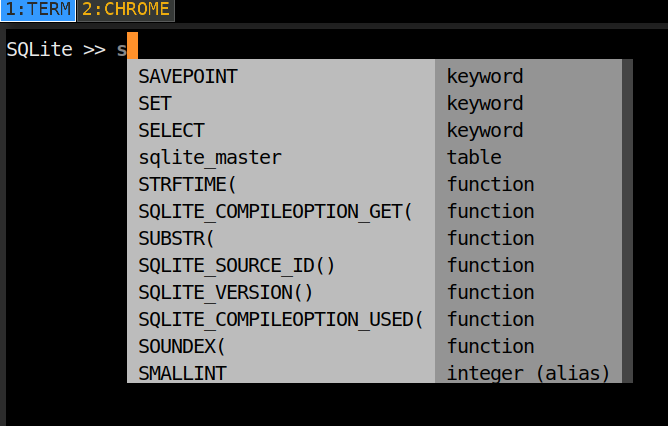
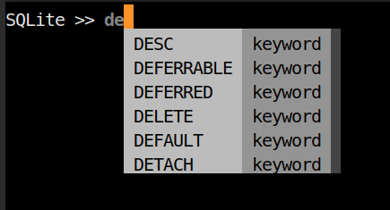

# SQLite Clinet written in python3

**TODO**
- [ ] Screenshots
- [ ] Expand db.py
- [ ] Test db.py

## Good completion

**NOTE** the database will be dropped in ~/.sqlite

## Limitations

- Not context sensitive,
- doesn't complete table names
- relies on pandas for displaying data

------------------------------------------------------------------------

#### Dependencies

- [prompt-toolkit](https://github.com/jonathanslenders/python-prompt-toolkit)
- [pandas](https://pandas.pydata.org/)
- python3.6

##### Related

-  [mycli](https://github.com/dbcli/mycli)

